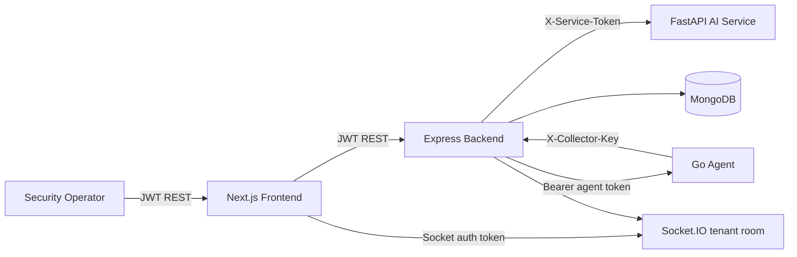

# Architecture And Trust Boundaries

## Trust Boundaries

- **Browser to backend:** bearer JWT required after login. JWT contains `tenantId` and `role`.
- **Agent to backend:** `X-Collector-Key` only. Backend derives tenant, adapter, source family, and event hash server-side.
- **Backend to AI service:** shared service token when configured.
- **Backend to agent action API:** bearer agent token.
- **Socket.IO:** requires `handshake.auth.token`, joins only `tenant:<tenantId>`, and emits tenant-scoped events.
- **Persistence:** Compose uses MongoDB by default. Memory mode is development/test-only.

## Runtime Data Flow

1. Event is submitted by an authenticated user or collector.
2. Backend validates size and schema limits.
3. Sensitive content is sanitized before persistence and AI calls.
4. Structured events use backend scoring; text events use AI rules + TF-IDF hybrid.
5. Correlation uses a tenant-specific time window and reuses canonical incident IDs.
6. Incidents merge timeline, evidence, signals, actions, and audit history.
7. Response actions require approval when sensitive and write receipts.
