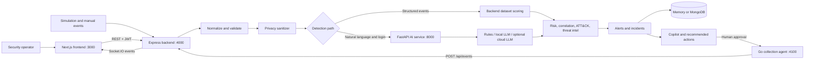

# MCIPS SecureLens: Detailed Product, Architecture, Security, and AI Audit

**Audit date:** June 14, 2026  
**Repository:** MCIPS  
**Audit type:** Static code review, automated verification, and live local-stack smoke testing  
**Current competition-readiness estimate:** **62/100**

> A literal 100/100 cannot be guaranteed without the competition's official rubric. This report uses a strict 100-point rubric appropriate for a cybersecurity and AI project competition.

## 1. Executive Verdict

MCIPS SecureLens is an end-to-end cyber-defense prototype for small and medium organizations. It accepts security events from a web interface, simulations, datasets, and a Go collection agent; sanitizes sensitive data; classifies threats; enriches alerts with risk explanations, MITRE ATT&CK candidates, and local threat intelligence; builds incidents; provides an AI copilot; and supports human approval of response actions.

The project is stronger than a dashboard-only demo because the main workflow is real and connected:

1. An event enters the backend.
2. Its schema is normalized and validated.
3. Sensitive content is sanitized.
4. A rules engine, structured scorer, or AI service classifies it.
5. The backend calculates explainable risk and tries to correlate related signals.
6. An incident, timeline, graph, actions, and audit entries are created.
7. The frontend receives live Socket.IO updates.
8. A human can approve a response action sent to the Go agent.

The current implementation is nevertheless a **competition prototype, not a production security platform**. The largest blockers are:

- Correlated alerts do not reliably merge into the original incident.
- Public event ingestion can spoof tenants and event metadata.
- WebSocket subscriptions are not authenticated.
- Failed agent actions can be reported as successfully completed.
- Production-dangerous default secrets and in-memory persistence are enabled.
- The active threat classifier is primarily deterministic rules, while the experimental trained model is not integrated into the live inference path.
- The ML dataset is too small to support strong performance claims.
- There is no CI pipeline, complete deployment stack, frontend test suite, agent test suite, or full end-to-end security test.

The project can become competition-leading if it presents itself honestly as a **privacy-first hybrid detection and response platform** and backs that claim with measured AI results, secure tenant isolation, correct incident correlation, and a polished evidence-based demo.

## 2. What the Application Is

**Short product description**

MCIPS SecureLens is a privacy-first security operations platform that detects and correlates phishing, suspicious authentication, network intrusion, and log anomaly signals. It is designed around Moroccan and multilingual threat contexts, especially financial impersonation and account-compromise scenarios.

**Startup-style positioning**

> SecureLens gives smaller organizations an affordable security operations layer that collects local telemetry, removes sensitive information before analysis, combines deterministic detection with local or cloud AI, correlates weak signals into incidents, explains why risk increased, and keeps a human in control of response actions.

**Strong differentiators already present**

- Morocco-specific bank impersonation and multilingual detection context.
- Privacy sanitization before downstream analysis and storage.
- Hybrid local-first AI with deterministic fallback.
- Cross-domain event support: messaging, login, system logs, email features, and network telemetry.
- Explainable risk factors rather than only an opaque label.
- Human approval before sensitive response actions.
- A Linux-oriented Go sidecar for collection and local action execution.
- A focused operations interface instead of a generic admin dashboard.

## 3. Current Architecture



### Active components

| Component | Technology | Responsibility |
|---|---|---|
| Frontend | Next.js 15, React 19, Axios, Recharts, Socket.IO client | Authentication, operational workspaces, live alerts, incident review, copilot, simulations, approvals |
| Backend | Node.js, TypeScript, Express, Socket.IO, Zod, Mongoose | API, validation, sanitization, orchestration, correlation, risk, incidents, auth, statistics |
| AI service | Python, FastAPI, Pydantic, HTTPX | Text/login analysis, incident reasoning, copilot answers, local/cloud reasoning fallback |
| Agent | Go standard library | Watches SMS/auth NDJSON files, forwards events, exposes health, writes approved-action artifacts |
| Persistence | In-memory by default, MongoDB optional | Alerts, event logs, incidents |

### Architectural debt

The backend contains older `users`, `threats`, controller, entity, and use-case modules that are not mounted by the active application. They increase cognitive load and make the system look more complete than the live runtime actually is. Remove them, archive them, or clearly label them as inactive.

## 4. How the Frontend Works

### Authentication

1. The login page calls `POST /api/auth/login`.
2. The returned JWT is saved in browser `localStorage` as `mcips_token`.
3. The Axios interceptor adds `Authorization: Bearer <token>` to API requests.
4. `useAuth(true)` calls `/api/auth/me` and redirects invalid sessions to `/login`.
5. Logout calls the backend and removes the local token.

Current limitation: backend logout does not revoke the JWT. A stolen token remains valid until expiration.

### Shared workspace state

`frontend/src/components/mission-control/workspace-context.tsx` is the main client-side orchestrator. It loads:

- recent alerts;
- incidents;
- copilot feed;
- summary statistics;
- timeline statistics;
- simulation status;
- backend and agent health.

It also owns the selected incident and exposes operations for:

- manual event submission;
- running the phishing-login scenario;
- starting and stopping simulation;
- asking the copilot;
- approving and rejecting actions;
- exporting sanitized incident evidence.

### Live updates

The frontend connects to Socket.IO and listens for:

- `alert:new`;
- `incident:update`;
- `copilot:feed`;
- `stats:update`;
- `simulation:status`;
- `system:status`.

This makes the dashboard feel live, but the socket currently sends no authentication token and the server does not authorize subscriptions.

### User-facing workspaces

| Route | Purpose |
|---|---|
| `/dashboard` | Risk posture, priority incident, case queue, copilot, pending actions, signal stream |
| `/dashboard/copilot` | Incident-grounded investigation and recommended next steps |
| `/dashboard/incidents` | Incident timeline, evidence, risk factors, ATT&CK candidates, threat intelligence, actions |
| `/dashboard/inbox` | Suspicious messages and incoming signal triage |
| `/dashboard/operations` | Pending approvals, completed actions, agent status |
| `/dashboard/demo-lab` | Named scenarios, simulation controls, manual event creation |

### Frontend strengths

- Clear separation between overview, investigation, response, and demo workflows.
- Sanitized previews and explainable factors are visible to the operator.
- Action approvals are integrated into the incident view.
- The current blue/navy/white/yellow visual direction is more focused than a generic dense SOC dashboard.
- Production build succeeds with type checking.

### Frontend gaps

- JWT in `localStorage` increases impact of an XSS vulnerability.
- No frontend unit, component, accessibility, or browser end-to-end tests.
- Shared `Promise.all` refresh has no user-visible partial-failure handling.
- Mutations lack consistent loading, retry, and duplicate-click protection.
- Socket connection is unauthenticated and not tenant-scoped.
- There is no route-level authorization beyond “has a valid admin token.”
- No CSP is configured in Next.js.
- Accessibility has not been verified with automated or keyboard tests.
- The Next.js build reports an incorrect workspace-root warning caused by multiple lockfiles.

## 5. How the Backend Works

### Active API areas

| Area | Main routes | Protection |
|---|---|---|
| Health | `GET /health` | Public |
| Auth | login, current user, logout | Login public; others JWT |
| Events | single ingestion, batch ingestion, supported types | Public |
| Alerts | list, recent, detail, export | JWT |
| Incidents | list, detail, timeline, status, approve, reject | JWT |
| Statistics | summary, timeline | JWT |
| Simulation | start, stop, status, once, phishing-login scenario | JWT |
| Copilot | feed, incident question | JWT |

### Event ingestion pipeline

The active flow in `ingestion-pipeline.service.ts` is:

1. Normalize legacy or unified event formats.
2. Validate the normalized discriminated event schema with Zod.
3. Check duplicate event logs using tenant, adapter, reference, hash, and time window.
4. Sanitize PII and sensitive content.
5. Select structured local scoring or the AI service.
6. Create a draft alert.
7. Add correlation, explainable risk, ATT&CK candidates, threat intelligence, title, and actions.
8. Persist alert and event log.
9. Create or update an incident and request AI reasoning.
10. Recalculate statistics.
11. Broadcast updates through Socket.IO.

### Supported event types

- `sms.message.received`
- `email.message.received`
- `text.message.received`
- `auth.login.attempt`
- `log.anomaly.detected`
- `phishing.email.detected`
- `net.intrusion.suspected`

### Privacy flow

The sanitizer masks or removes:

- recognized Moroccan bank names;
- email addresses;
- Moroccan-style phone numbers;
- OTP/PIN patterns;
- long account numbers;
- selected ID patterns;
- URLs;
- selected names;
- IPv4 addresses and session/user markers in login/log events;
- raw phishing email text, replacing it with a hash and derived metadata.

This is a strong product principle. It is not yet a complete privacy control because regex coverage is limited and `STORE_RAW_CONTENT` is configured but not enforced in the active pipeline.

### Detection and enrichment

The backend uses two paths:

- Natural-language and login events call the AI service.
- Structured network, log, and phishing-feature events use deterministic backend scoring.

The alert is then enriched with:

- final risk score and contributing factors;
- severity;
- correlation metadata;
- recommended actions;
- candidate MITRE ATT&CK mappings;
- local threat-intelligence indicators;
- incident graph and evidence chain.

### Incident response

An incident contains:

- timeline entries;
- correlated signals;
- summary and recommended actions;
- AI provenance;
- ATT&CK and threat-intelligence data;
- audit trail;
- notification history;
- response actions and approval state.

Sensitive actions such as forced password reset require operator approval. Approved actions are sent to the Go agent, which currently writes a local artifact or blocklist entry rather than integrating with a real identity, EDR, firewall, or email gateway.

## 6. How the AI Service Works

### Active inference behavior

For SMS, email, and text:

1. Normalize Unicode and whitespace.
2. Detect weighted features such as suspicious links, urgency, financial language, credentials, OTP requests, prizes, and account-blocking claims.
3. Convert the score into label, risk, confidence, and explanation.
4. Optionally call a configured free OpenRouter model.
5. Reject a cloud “safe” answer if the local result is already high risk.
6. Fall back to local deterministic classification on provider or parsing failure.

For login events:

- A deterministic anomaly service scores country, IP prefix, device, and user-agent markers.

For incident reasoning and copilot:

- The service can use a local Ollama-compatible model.
- It can optionally use an OpenRouter model.
- It always has a deterministic fallback.

### Important truth about the current AI claim

The live classification endpoint reported:

```json
{
  "label": "phishing",
  "risk": "HIGH",
  "confidence": 0.93,
  "model_used": "local_rules_v1",
  "fallback_used": true
}
```

This means the active classifier is currently a multilingual weighted rules engine. That is useful, explainable, and resilient, but judges should not be told it is a trained production ML model.

The repository also contains experimental TF-IDF/logistic-regression and anomaly-detector code, but:

- the trained classifier is not wired into the active API;
- the model dataset contains only 9 documented samples;
- the dataset card says both 8 and 9 samples;
- test F1 is documented as `0.6667`;
- the model card makes unverified latency, throughput, monitoring, and “full language support” claims;
- `numpy` and `scikit-learn` are absent from `requirements.txt`;
- `vectorize.py` is empty;
- Isolation Forest objects are instantiated but not trained or used in active predictions.

These inconsistencies are a major competition risk because technically experienced judges will detect them quickly.

## 7. Verification Performed

### Automated checks

| Check | Result |
|---|---|
| Backend tests | **24/24 passed** |
| AI tests | **12/12 passed** |
| Frontend production build and type check | **Passed** |
| Go build | **Passed** |
| Go vet | **Passed** |
| Go tests | No test files |
| Frontend tests | No test files |

### Live-stack checks

| Service | Result |
|---|---|
| Frontend on port 3000 | HTTP `200` |
| Backend on port 4000 | Healthy |
| AI service on port 8000 | Healthy |
| Go agent on port 4100 | Healthy |
| Backend-to-agent health integration | Working |
| AI direct phishing analysis | Working |
| Protected auth, stats, incidents, copilot, and simulation APIs | HTTP `200` with JWT |
| Event type discovery | 7 event types returned |

### Live runtime observations

- Backend persistence mode is `memory`; data is lost on restart.
- The AI health endpoint reports the local reasoning model as reachable.
- The Go agent reports healthy SMS and auth collectors.
- Live state contained 13 alerts, 13 incidents, and 5 alerts marked as correlated.
- The mismatch above helped confirm the incident-correlation defect described below.

## 8. Estimated Competition Score

| Category | Maximum | Current | Main reason |
|---|---:|---:|---|
| Problem relevance and impact | 10 | 8 | Strong SME/Morocco security problem; market evidence is not shown |
| End-to-end product completeness | 15 | 12 | Real connected workflow; some actions and notifications are simulations |
| Cybersecurity depth and correctness | 20 | 10 | Good concepts, but tenant, socket, secret, and action-state weaknesses are serious |
| AI/ML rigor and innovation | 20 | 8 | Explainable hybrid design; active classifier is rules and evaluation is insufficient |
| Privacy and responsible AI | 10 | 7 | Sanitization and provenance are strong; leakage testing and governance are incomplete |
| UX and demo storytelling | 10 | 8 | Focused workflows and live demo; error/accessibility polish is missing |
| Engineering quality and testing | 10 | 6 | Backend/AI tests pass; no frontend/agent/E2E/CI coverage |
| Deployment and documentation | 5 | 3 | Good README and AI Dockerfile; no complete reproducible deployment |
| **Total** | **100** | **62** | Strong prototype, not yet defensible as a production-grade cyber-AI system |

## 9. Findings Ordered by Severity

### Critical

#### C1. Correlation creates fragmented incidents

`incidentCorrelation.service.ts` assigns a correlated alert's `incidentId` from `matchingSignals[0].alertId`. The original signal has its own incident ID, usually `incident-<eventId>`. The new alert therefore creates or updates an incident whose ID is the previous **alert ID**, not the previous **incident ID**.

**Impact:** one attack chain appears as multiple incidents, timelines are incomplete, response actions can be attached to the wrong record, and competition claims about cross-signal incident correlation are not fully true.

**Live evidence:** a correlated alert used its previous alert ID as its incident ID, while that previous alert belonged to a different `incident-...` record.

**Required fix:** carry `incidentId` in `CorrelatedSignal` or retain the matched `AlertRecord`, reuse `matchedAlert.incidentId`, merge timelines and signals, and add a test asserting two correlated alerts produce exactly one incident.

#### C2. Event ingestion and tenant identity are not trusted boundaries

`POST /api/events` and `/api/events/batch` are public. Clients can submit `tenantId`, `sourceFamily`, `sourceAdapter`, `eventHash`, source, timestamps, and agent risk hints.

**Impact:** an attacker can inject false alerts, spoof another tenant, manipulate correlation, poison statistics, or create operational noise.

**Required fix:** authenticate collectors with scoped API keys or mTLS, derive tenant and adapter identity from credentials, ignore client-supplied trust fields, sign events, and add replay protection.

#### C3. WebSocket data is not authenticated or tenant-scoped

Socket.IO validates origins but not user identity. Any allowed-origin client can receive alert, incident, statistics, action, and system events.

**Impact:** sensitive security metadata can cross user or tenant boundaries.

**Required fix:** validate JWT/session during the Socket.IO handshake, join only authorized tenant rooms, and emit every event to a tenant room rather than globally.

#### C4. Failed agent execution can be recorded as completed

The backend agent client returns `accepted: true` in simulation mode when the real agent call fails. `IncidentService.approveAction` then marks the action `completed` without checking `accepted`.

**Impact:** operators may believe containment happened when no control changed. This is dangerous in a real incident and damaging in a judge demonstration.

**Required fix:** use explicit states such as `approved`, `dispatching`, `completed`, `failed`, and `simulated`; fail closed; store provider receipts; require idempotency keys; never equate simulation with successful execution.

### High

#### H1. Production defaults are unsafe

Defaults include `JWT_SECRET=change-me`, `AGENT_API_TOKEN=agent-secret`, one known admin account, and in-memory persistence. MongoDB failure silently degrades to memory mode.

**Fix:** validate environment variables at startup, refuse production boot with default secrets, require durable storage in production, and expose degraded health with a non-ready readiness status.

#### H2. Authentication is single-user and tokens are stored in localStorage

There is no user database, RBAC, MFA, refresh-token rotation, session revocation, or tenant claim. The browser token is readable by JavaScript.

**Fix:** use secure, `HttpOnly`, `SameSite` cookies or a hardened OIDC provider; add roles such as viewer, analyst, responder, and admin; bind all data access to tenant and role.

#### H3. Backend-to-AI and backend-to-agent trust is weak

The AI API is unauthenticated. The agent uses one static bearer token over plain HTTP by default.

**Fix:** use service identities, mTLS or rotated short-lived credentials, network policies, request signing, replay prevention, and least-privilege scopes.

#### H4. The AI evidence is not competition-grade

The active classifier is rules, the experimental model is not integrated, the documented dataset is only nine samples, and performance claims are not reproducible.

**Fix:** build a versioned dataset, establish train/validation/test splits by campaign and time, integrate a real model behind a feature flag, compare it against rules, calibrate probabilities, and publish reproducible metrics.

#### H5. Threat-intelligence logic can misclassify domains

Safe-domain matching uses substring checks. A hostname such as `google.com.attacker.example` can be treated as containing a safe domain. Sanitization can also replace URLs before indicator extraction, removing useful evidence.

**Fix:** extract normalized privacy-safe indicators before text masking; parse hostnames with URL/domain libraries; match exact registrable domains or approved subdomains; retain hashes and provenance.

#### H6. Privacy protection is useful but incomplete

Regexes do not comprehensively cover IPv6, IBAN/RIB, secrets, API keys, JWTs, addresses, names without titles, encoded URLs, or obfuscated Unicode. Derived tokens can still leak sensitive words.

**Fix:** create a multilingual privacy-red-team corpus, add structured secret/PII detectors, normalize before masking, measure leakage rate, and enforce a documented retention policy.

#### H7. The system will not scale safely

The pipeline reads all prior alerts, statistics scan all alerts, repositories return unbounded lists, batch processing is sequential, and alert/event/incident writes are not transactional.

**Fix:** add pagination and tenant/time indexes, query only the correlation window, use background queues, make processing idempotent, and use transactions or an outbox pattern.

#### H8. MITRE ATT&CK mappings need technical correction

Some mappings are overly broad or use questionable tactic associations. For example, phishing technique `T1566` is presented as Credential Access in a test, and network signals can map to exfiltration without supporting evidence.

**Fix:** treat mappings as confidence-scored candidates, align tactic/technique semantics with the current ATT&CK version, link each mapping to evidence and official technique URLs, and add analyst override.

### Medium

- Notification dry-run marks messages as delivered even when no provider sends them.
- Copilot output lacks direct citations to timeline/evidence IDs.
- Untrusted event text can enter LLM reasoning without a dedicated prompt-injection evaluation.
- Missing incident/action IDs can return unchanged data instead of a precise `404`.
- Incident status transitions are unrestricted and operator identity is absent from audit entries.
- Audit records are mutable and have no integrity chain.
- API schemas have few maximum string, array, and batch limits.
- AI CORS allows `*` with credentials enabled.
- AI dependencies are recreated per request and inference logs are not durable.
- Statistics count correlated alerts rather than distinct incidents.
- MongoDB schemas rely heavily on `Mixed`, reducing validation.
- There is no structured production logging, metrics, tracing, alerting, SLO, or backup test.
- There is no SBOM, dependency vulnerability scan, secret scan, SAST, DAST, or container scan in CI.
- A compiled Go binary is committed to Git.
- Only the AI service has a Dockerfile.

## 10. Roadmap to a Defensible 100/100

### Phase 0: Fix demo-trust defects, 1-2 days

1. Fix incident ID reuse and add a one-incident correlation test.
2. Stop marking simulated or failed actions as completed.
3. Correct notification delivery semantics.
4. Correct domain matching and ATT&CK mappings.
5. Add clear UI badges: `Rules`, `Local model`, `Cloud model`, `Fallback`, `Simulated action`, `Executed action`.
6. Remove unsupported model-card claims.

**Exit criteria:** the named phishing-login scenario creates one incident with two timeline events, one evidence chain, and truthful action status.

### Phase 1: Secure the platform boundary, 3-5 days

1. Protect ingestion with collector credentials.
2. Derive tenant identity from credentials.
3. Authenticate and tenant-scope Socket.IO.
4. Add RBAC and operator identity to audit entries.
5. Replace browser localStorage auth with secure session handling.
6. Enforce production configuration validation and secret rotation.
7. Authenticate backend-to-AI and backend-to-agent traffic.
8. Add input, batch, and content size limits.

**Exit criteria:** automated tests prove cross-tenant reads, writes, event injection, and socket subscriptions are denied.

### Phase 2: Make the AI claim scientifically strong, 1-2 weeks

1. Collect at least several thousand legally usable, deduplicated examples across English, French, Arabic, and Darija.
2. Include benign hard negatives, obfuscation, Unicode, URL shorteners, QR lures, and campaign families.
3. Split by campaign/source/time to prevent leakage.
4. Compare rules, character/word TF-IDF, multilingual transformer, and hybrid ensemble baselines.
5. Report per-language precision, recall, F1, PR-AUC, confusion matrices, calibration error, and latency.
6. Choose thresholds based on business cost, especially false negatives.
7. Wire the selected model into the active API with versioned artifacts and rollback.
8. Preserve deterministic rules as an independent fallback and ensemble signal.
9. Add adversarial robustness and prompt-injection evaluations.
10. Add drift, confidence, latency, and fallback-rate monitoring.

**Exit criteria:** a reproducible command trains and evaluates the model, and the live API reports the exact model version and calibrated confidence.

### Phase 3: Production-grade incident engineering, 3-7 days

1. Require MongoDB or PostgreSQL in production.
2. Add tenant/time/status indexes and pagination.
3. Introduce a queue for event processing and retries.
4. Add transactional or outbox-based alert/event/incident consistency.
5. Add idempotent action execution with signed receipts.
6. Add real connectors for one response path, such as Keycloak password reset, firewall block, or email gateway quarantine.
7. Use an append-only or hash-chained audit log.
8. Add retention, deletion, and backup/restore workflows.

**Exit criteria:** a load test, restart test, duplicate-delivery test, and agent-offline test all preserve correct incident state.

### Phase 4: Complete the quality and deployment story, 3-5 days

1. Add frontend component and Playwright tests.
2. Add Go unit/integration tests.
3. Add full-stack contract and end-to-end tests.
4. Add CI for tests, type checks, linting, SAST, dependency audit, secret scan, SBOM, and container scan.
5. Add Dockerfiles for all services and one `docker compose up` deployment.
6. Add readiness/liveness probes, structured logs, OpenTelemetry traces, and Prometheus metrics.
7. Resolve workspace lockfile and committed-binary issues.
8. Document threat model, data flow, trust boundaries, abuse cases, and recovery plan.

**Exit criteria:** a clean checkout starts reproducibly with one command and produces a signed test/security report.

### Phase 5: Competition presentation and evidence, 2-3 days

1. Show the business problem with Morocco-specific evidence and a defined target customer.
2. Quantify time saved, false-positive reduction, privacy leakage rate, and detection metrics.
3. Demonstrate a real collector event, not only a simulator.
4. Show sanitization before model processing.
5. Show two signals becoming one incident.
6. Show model provenance and evidence-backed explanation.
7. Require human approval.
8. Execute one real, reversible containment action.
9. Show the append-only audit receipt.
10. Finish with architecture, measured results, limitations, and deployment cost.

## 11. Recommended 3-Minute Judge Demo

| Time | Demonstration |
|---|---|
| 0:00-0:20 | State the SME problem, Morocco focus, and privacy-first differentiator |
| 0:20-0:45 | Append a realistic phishing SMS to the Go agent input |
| 0:45-1:10 | Show PII/URL sanitization, model version, confidence, and risk factors |
| 1:10-1:35 | Ingest a suspicious login and show both signals merge into one incident |
| 1:35-2:00 | Show timeline, ATT&CK candidates, threat intel, graph, and evidence IDs |
| 2:00-2:25 | Ask the copilot what to do first and show citations to incident evidence |
| 2:25-2:45 | Approve one reversible action and show the signed agent receipt |
| 2:45-3:00 | Show measured F1/recall, privacy leakage, latency, tests, and deployment cost |

## 12. Evidence Package Judges Should Receive

- One-page product brief and target-customer profile.
- Architecture and trust-boundary diagram.
- Threat model using STRIDE or an equivalent method.
- Current NIST CSF 2.0 function mapping.
- Data card with provenance, consent/licensing, language distribution, and limitations.
- Model card generated from reproducible evaluation output.
- Per-language and campaign-separated evaluation report.
- Privacy leakage test report.
- Prompt-injection and adversarial-evasion report.
- Test matrix and coverage report.
- SBOM and dependency/container scan results.
- API specification and event schema versioning policy.
- Incident-response runbook.
- Demo script and fallback recording.
- Clear list of simulated versus real integrations.

## 13. Proposed Definition of 100 Points

| Category | Full-score evidence |
|---|---|
| Problem and impact, 10/10 | Validated target users, quantified pain, Morocco relevance, credible adoption plan |
| Product, 15/15 | Real collector-to-detection-to-one-incident-to-response workflow |
| Cybersecurity, 20/20 | Tenant isolation, secure identity, correct ATT&CK/evidence, threat model, secure actions |
| AI/ML, 20/20 | Integrated model, reproducible multilingual evaluation, calibration, robustness, monitoring |
| Privacy, 10/10 | Measured low leakage, retention/deletion controls, local-first processing, responsible-AI evidence |
| UX, 10/10 | Fast triage, accessible workflows, clear provenance, polished failure states |
| Engineering, 10/10 | Full-stack tests, CI security gates, observability, resilience and load evidence |
| Deployment, 5/5 | One-command reproducible deployment, operations docs, backup/recovery, cost estimate |

## 14. Standards Baseline

Recommendations in this audit are aligned with these official references:

- [NIST Cybersecurity Framework 2.0](https://www.nist.gov/cyberframework)
- [NIST AI Risk Management Framework](https://www.nist.gov/itl/ai-risk-management-framework)
- [NIST AI 600-1: Generative AI Profile](https://doi.org/10.6028/NIST.AI.600-1)
- [NIST SP 800-61 Revision 3: Incident Response Recommendations](https://csrc.nist.gov/pubs/sp/800/61/r3/final)
- [NIST SP 800-218: Secure Software Development Framework](https://csrc.nist.gov/pubs/sp/800/218/final)
- [OWASP Application Security Verification Standard](https://owasp.org/www-project-application-security-verification-standard/)
- [OWASP API Security Top 10](https://owasp.org/www-project-api-security/)
- [OWASP Top 10 for LLM and Generative AI Applications](https://genai.owasp.org/llm-top-10/)
- [MITRE ATT&CK Enterprise](https://attack.mitre.org/)

## 15. Final Assessment

MCIPS already has the structure of a compelling competition project: a relevant local problem, live collection, privacy controls, hybrid reasoning, incident workflows, human approval, and a professional operations interface.

Its next step is not adding more screens or more AI terminology. The highest-value work is to make four claims fully true and measurable:

1. Related signals become one correct incident.
2. Every data and action boundary is authenticated and tenant-safe.
3. The AI model is genuinely integrated, reproducibly evaluated, and honestly described.
4. A response marked completed was demonstrably executed.

Completing those items, then packaging the evidence in a disciplined three-minute demo, would move SecureLens from a strong prototype toward a top-tier cybersecurity and AI competition submission.
